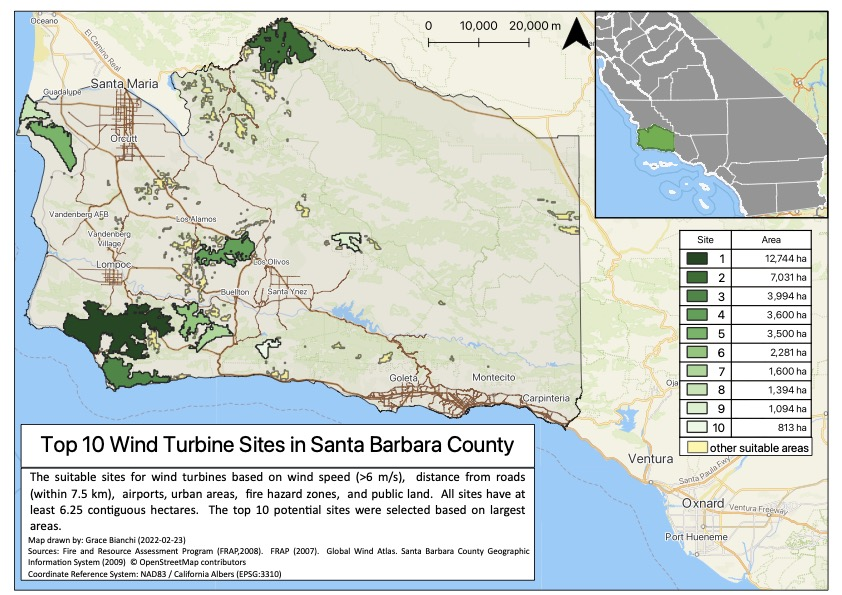
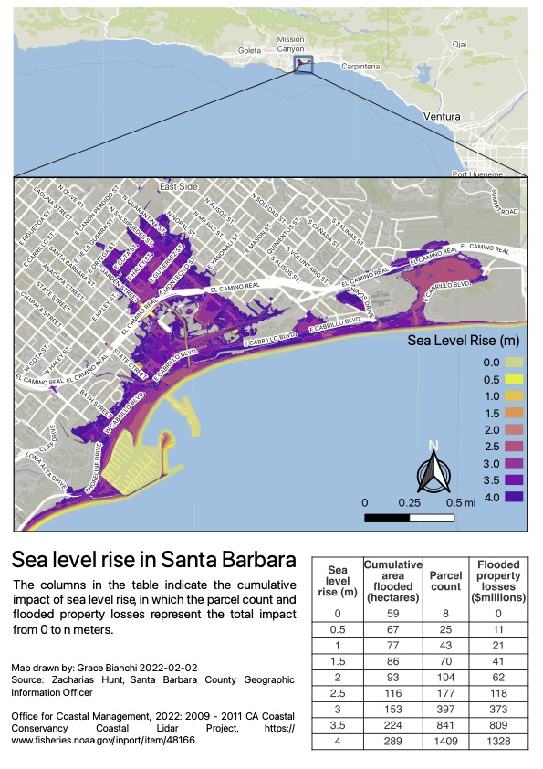
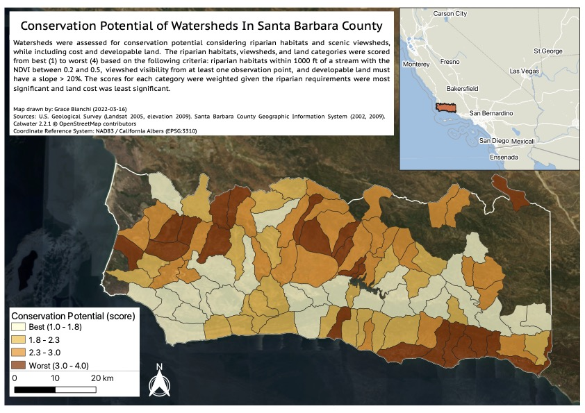

```{r image-ref-for-in-text, echo = FALSE, message=FALSE, fig.align='center',  out.width='100%', out.height='100%', fig.pos='H'}

```

<br>


<br>
<br>


```{r, fig.align='center', out.width='100%', out.height='200%', fig.pos='V', echo=FALSE}

```

<br>

<br>

```{r, fig.align='center',  out.width='100%', out.height='100%', fig.pos='H'}

```


